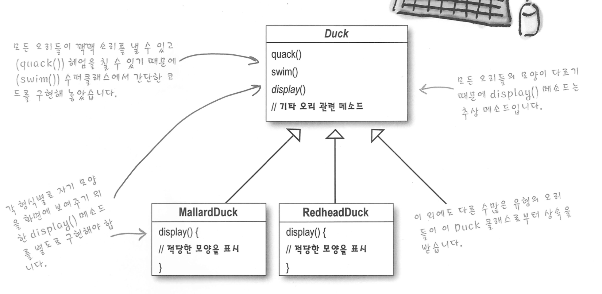

# 디자인패턴 스터디

## 스트래티지 패턴

알고리즘군을 정의하고 각각을 캡슐화하여 교환해서 사용할 수 있게 함
스트래티지 패턴을 사용하면 알고리즘을 사용하는 클라이언트와는 독립적으로 알고리즘을 변경할 수 있다.

### 예제로 이해하기

오리 게임을 만든다고 했을 때, 쉽게 Duck이라는 super class를 만들고, 그것을 상속받아 각 오리의 특징을 정의한 sub class를 만들 수 있다.

- 위의 설계대로라면 발생할 수 있는 문제
    - 고무 [오리], 나무 [오리] 처럼 생물이 아닌 오리 객체가 Duck 수퍼 클래스를 상속받으면 특정 메소드를 오버라이딩 해야함 (quack() 메소드 호출시 고무오리는 뾱뾱거려야하고, 나무오리는 울면 안되기 때문에..)
    - 상속은 올바른 해결책이 아님
    - 인터페이스로 회피해봐도 행동에 대한 코드 재사용이 어려워진다.
        - 예를 들어, 서브 클래스에서 fly() 메소드를 조금 바꾸려면 fly()를 구현한 모든 서브 클래스를 수정해야함 → 좃같음

### 디자인 원칙 #1

애플리케이션에서 달라지는 부분을 찾아내어서 달라지지 않는 부분으로부터 분리시킨다!

→ 캡슐화

나중에 바뀌지 않는 부분에는 영향을 미치지 않은 채로 그 부분만 고치거나 확장할 수 있다.

즉, 예제로 설명하면 달라지지 않는 부분인 swim()은 Duck 수퍼 클래스의 메소드로 두고

달라지는 부분인 quack() 과 fly() 메소드는 별도의 클래스 집합으로 캡슐화한다.

### 디자인 원칙 #2

구현이 아닌 인터페이스에 맞춰서 프로그래밍한다.

→ 다형성

서브클래스에서 재생성(구현)해서 쓰지말고, 인터페이스에 맞추어서 구현은 따로 해서 쓰란뜻

각 행동은 Duck 수퍼 클래스에서는 인터페이스로 표현하고, 행동을 구현한 행동 클래스를 따로 만들어, 행동 클래스의 집합을 만들기

이게 뭔소리냐..

1. Fly(날다)라는 행동이 있을 때, Duck 수퍼 클래스에서는  FlyBehavior 인터페이스로 Fly를 표현한다.

Duck (super class)

---

      FlyBehavior flyBehavior;

1. FlyBehavior 인터페이스의 내용은?

FlyBehavior (interface)

---

public void fly();  

1. 그리고 FlyBehavior 인터페이스를 상속받아서 행동을 구현한 행동 클래스를 따로 만든다.

FlyWithWings (Sub class) implements FlyBehavior

---

public void fly() {  // 날 수 있는 오리의 행동 구현하기 }

FlyNoWay (Sub class) implements FlyBehavior

---

public void fly() {  // 날 수 없는 오리의 행동 구현하기 }

1. Duck을 상속받는 서브 클래스, 빨간머리 오리를 구현하자!

RedHatDuck (Sub class) extends Duck

---

public RedHatDuck() {   ← 생성자

flyBehavior = new FlyWitheWings();    ← 빨간머리 오리는 날 수 있으므로 FlyWithWings 클래스로 객체 생성해주기

}

1. 메인에서 빨간머리 오리를 동작시켜보자!

main

---

Duck redHatDuck = new RedHatDuck();

redHatDuck.fly();    ← 날 수 있는 빨간머리 오리가 나는 동작 실행!

### 디자인 원칙 #3

상속보다는 구성(Composition)을 활용하기

- 구성이 머야?
    - 두 클래스를 Duck class의 FlyBehavior와 QuackBehavior 처럼 합치는 것을 구성이라고 한다.
    - 장점 : 단순히 알고리즘군을 별도의 클래스의 집합으로 캡슐화할 수 있게 만들어주는 것 뿐 아니라 구성요소로 사용하는 객체에서 올바른 행동 인터페이스를 구현하기만 하면 실행시 동적으로 행동을 바꿀 수도 있다. ⇒ 유연성 증가

## 옵저버 패턴

뭔가 중요한 일이 일어났을 때 객체들에게 새소식을 알려줄 수 있는 패턴!

객체 쪽에서는 계속해서 정보를 받을지 말지 여부를 실행 중에 결정할 수 있다.

옵저버 패턴에서는 한 주제 객체의 상태가 바뀌면, 그 객체에 의존하는 ( = 그 객체를 구독하고 있는) 다른 객체들에게 연락이 되고 자동으로 내용이 갱신되는 방식으로 일대다 ( one - to - many ) 의존성을 정의한다.

### 예제로 이해하기

날씨 상황에 따라서 각각 현재 온도/습도를 보여주는 화면, 현재 체감온도를 보여주는 화면을 구현해야한다.

여기서 날씨 상황은 subject(주제) 라고 하고

날씨 상황이 업데이트 될 때마다 각각 현재 온도/습도 보여주는 화면과 현재 체감온도를 보여주는 화면을 observer (옵저버) 라고 한다.

1. subject 인터페이스와 observer 인터페이스를 각각 만든다.
2. subject 인터페이스를 상속받은 주제 , WeatherData 생성

    WeatherData ( class ) implements Subject

    ---

    Observer 배열 ( 변수)

    온도..조명..습도 (변수)

    public void AddObserver( Observer o ) { // 옵저버 배열에 옵저버 추가 }

    public void RemoveObserver ( Observer o ) { // 옵저버 배열에서 옵저버 제거 }

    public void notifyObservers ( ) { // 옵저버 배열을 돌면서 옵저버의 update() 메소드 호출 }

    public void dataChanged ( ) { // 데이터가 변경되었음을 알리는 메소드. notifyObservers 메소드를 호출 }

    public void setData ( 인자 ) {  // 온도..조명..습도.. 세팅하고 dataChanged 호출 }

1. Observer가 될 객체 생성

    CurrentConditionsDisplay ( class ) implements Observer, DisplyaElement

    ---

    Subject 변수

    public CurrentConditionsDisplay( Subect subject ) {

    this.Subject 변수 = subject;

    subject.AddObserver ( this );  ← 내 자신 (옵저버) 를 주제의 옵저버 배열에 등록

    }

    public void update() {

    // 주제 객체에서 호출할 내용

    }

1. main은?

    main

    ---

    WeatherData weatherData = new WeatherData();

    CurrentConditionsDisplay currentDisplay = new CurrentConditionsDisplay( weatherData );

    weatherData.setData ( 인자 ) ; ← Subject 객체가 업데이트 되었으니까 Observer 의 update 메소드가 호출된다

    ← 즉 여기서는 currentDisplay 의 update 가 호출됨

### 느슨한 결합 ( Loose Coupling )

주제와 옵저버는 서로 독립적으로 재사용할 수 있음.

주제 : 옵저버에 대해서 알 필요가 없음

옵저버 : 언제든 추가/제거가 가능하고 새로 추가해도 주제를 바꿀 필요가 없음

주제, 옵저버 둘 다 변경되어도 서로에게 끼치는 영향 1도 없음

### 디자인 패턴 #4

서로 상호작용하는 객체 사이에서는 가능하면 느슨하게 결합하는 디자인을 사용해야 한다.
